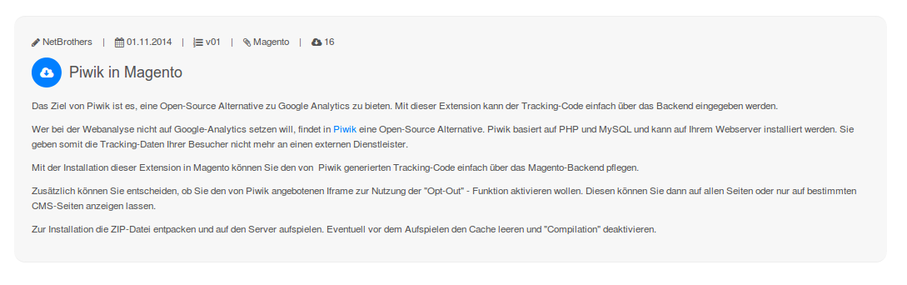
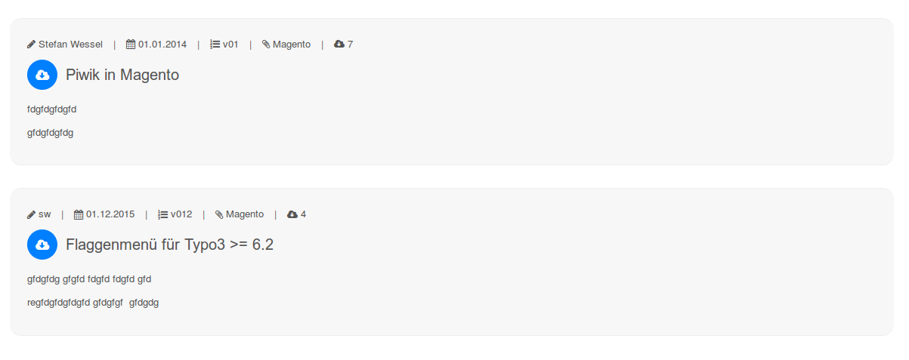
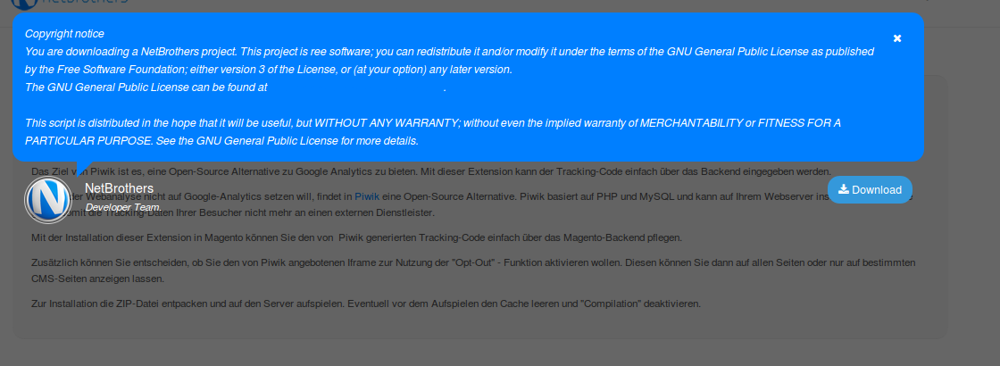

.. ==================================================
.. FOR YOUR INFORMATION
.. --------------------------------------------------
.. -*- coding: utf-8 -*- with BOM.

.. include:: ../Includes.txt

.. _introduction:

Introduction
============

.. _what-it-does:

What does it do?
----------------

**NetBrothers Downloader** provides a frontend plugin for managing download with categories and counter.

You will collect your downloadables file in a storage and allocate categories to every file.

You can either show a single file or a list of all files allocated to one category.

You can choose, if user has to accept your licence, before download starts.

.. note::
	Only zip-archives can be handled. If you like to handle other types, you have do modified the TCA.

.. _requirements:

Requirements
------------

#. **NetBrothers Downloader** needs at least Typo3 6.2 LTS.
#. If you like to use the licence feature: This extension requires jQuery. You have to take care by your own of loading jQuery ;-)
#. Design is based on Twitter Bootstrap and Font Awesome. Both are not implemented in this extension. If you like the default design, you have to implemented both by your own.

.. note::

    Thanks to Fluid it is easy to change the design (see :ref:`admin-manual` ).

.. _screenshots:

Screenshots
-----------

	Frontend view: Single.

	Frontend view: Category.

	Frontend view: User has to accept licence (jQuery needed).

