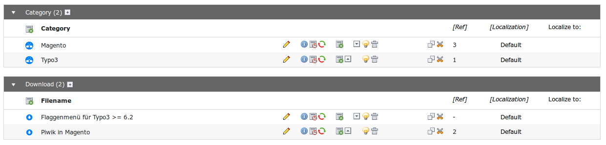
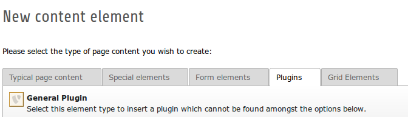
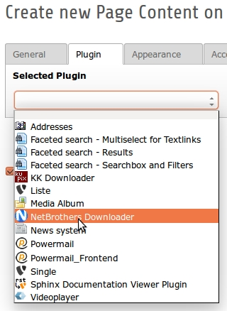
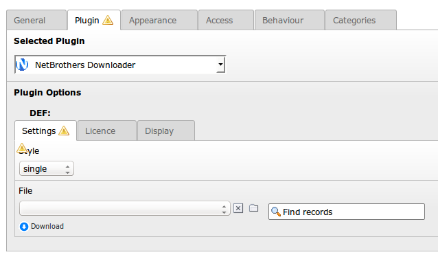
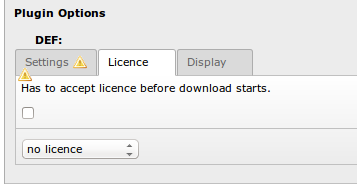
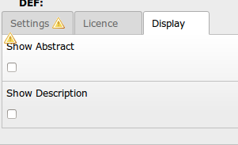

.. ==================================================
.. FOR YOUR INFORMATION
.. --------------------------------------------------
.. -*- coding: utf-8 -*- with BOM.

.. include:: ../../Includes.txt

.. _users-manual:

Users manual
============

Target group: **Users**

.. _Storage-Folder:

1. Storage
----------

Sie müssen Kategorien und Dateien in einem Storage-Ordner verwalten:

1. Erstellen Sie zuerst Kategorien
2. Fügen Sie dann Dateien hinzu

1.1 Erstellen Sie Kategorien
^^^^^^^^^^^^^^^^^^^^^^^^^^^^
Vergeben sie einfach einen Namen für die Kategorie.

1.2 Erstellen Sie Downloads
^^^^^^^^^^^^^^^^^^^^^^^^^^^

Erstellen Sie einen Download. Geben Sie dabei folgende Informationen ein:

+------------------------+----------------------------+
| Feld                   | Beschreibung               |
|                        |                            |
+========================+============================+
| Filename               | interner Name der Datei    |
| (Dateiname)            |                            |
+------------------------+----------------------------+
| Name for Download      | Angebotener Dateiname im   |
| (Name des download)    | Download-Dialog des        |
|                        | Browser                    |
+------------------------+----------------------------+
| Source                 | Relation zu Ihrer Datei    |
| (Datei)                |                            |
+------------------------+----------------------------+
| Abstract               | Kurzbeschreibung zur       |
| (Kurzbeschreibung)     | Ausgabe auf der Webseite   |
+------------------------+----------------------------+
| Description            | Langbeschreibung zur       |
| (Langbeschreibung)     | Ausgabe auf der Webseite   |
+------------------------+----------------------------+
| Author                 | Author                     |
+------------------------+----------------------------+
| Version                | Version                    |
+------------------------+----------------------------+
| Public Date            | Datum der Veröffentlichung |
| (Veröffentlicht am)    |                            |
+------------------------+----------------------------+
| Cat                    | zugeordnete Kategorie      |
| (Kategorie)            |                            |
+------------------------+----------------------------+
| Counter                | Anzahl Downloads           |
| (Anzahl Downloads)     | (leer lassen, um bei 0 zu  |
|                        | starten)                   |
+------------------------+----------------------------+

.. note::

	Sie können nur ZIP-Archive verwalten.

.. _add-frontend-plugin:

2. Fügen Sie das Plugin als Content-Element auf einer Seite ein
---------------------------------------------------------------

2.1 Plugin erstellen
^^^^^^^^^^^^^^^^^^^^

Erstellen Sie ein neues Inhaltselement. Wählen Sie dann **Plugins** => **General Plugins**.

2.2 Wählen Sie das Plugin aus
^^^^^^^^^^^^^^^^^^^^^^^^^^^^^

Wählen Sie **NetBrothers Downloader**.

.. _fill-flexform:

3. Bearbeiten Sie das Formular
------------------------------

3.1 Einzelner Download
^^^^^^^^^^^^^^^^^^^^^^
1. Wählen Sie **single** im Feld *Style*.
2. Nutzen Sie den Wizard, um Ihre Datei zu finden.

3.2 Kategorie Download
^^^^^^^^^^^^^^^^^^^^^^
1. Wählen Sie **category** im Feld *Style*.
2. Nutzen Sie den Wizard, um Ihre Kategorie zu finden. Alle Dateien dieser Kategorie werden dann auf der Webseite dargestellt.

3.3 Weitere Optionen
^^^^^^^^^^^^^^^^^^^^

Enstscheiden Sie, ob sie die Lizenz vor dem Download anzeigen wollen. Das Plugin bietet zwei unterschiedliche Templates für Lizenzen, die sie nach der Installation modifizieren sollten (see :ref:`admin-manual`). Nach der Installation sind beide Lizenz-Templates identisch mit der GNU - Lizenz.

Entscheiden Sie, ob Sie die Kurz und/oder Langbeschreibung der Datei(en) anzeigen wollen.

