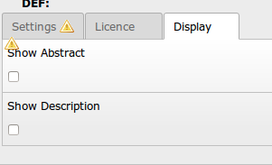

.. ==================================================
.. FOR YOUR INFORMATION
.. --------------------------------------------------
.. -*- coding: utf-8 -*- with BOM.

.. include:: ../Includes.txt

.. _users-manual:

Users manual
============

Target group: **Users**

.. _Storage-Folder:

1. Collect your categories and files in a storage folder
--------------------------------------------------------

You have to collect your downloads in a Storage-Folder. Here you adds categories and downloads.

1. First add category
2. Add files

.. figure:: ../Images/UserManual/02-Storage.png
	:width: 800px
	:alt: Create a new content element

1.1 Create category
^^^^^^^^^^^^^^^^^^^
Just add the name of the category and save.

1.2 Create or update Download
^^^^^^^^^^^^^^^^^^^^^^^^^^^^^

To create or update a download, add the following informations:

+------------------------+----------------------------+
| Field                  | Description                |
|                        |                            |
+========================+============================+
| Filename               | internal name of filename  |
+------------------------+----------------------------+
| Name for Download      | This string is used as name|
|                        | for the download dialog by |
|                        | the browser                |
+------------------------+----------------------------+
| Source                 | Relation to file           |
+------------------------+----------------------------+
| Abstract               | short description for      |
|                        | output on websiten         |
+------------------------+----------------------------+
| Description            | long description for output|
|                        | on websiten                |
+------------------------+----------------------------+
| Author                 | Author of download         |
+------------------------+----------------------------+
| Version                | Version of file            |
+------------------------+----------------------------+
| Public Date            | Date of release            |
+------------------------+----------------------------+
| Cat                    | related category           |
+------------------------+----------------------------+
| Counter                | number of downloads        |
|                        | (leave blank to start with |
|                        | zero)                      |
+------------------------+----------------------------+

.. note::

	You can just add zip-archives.

.. _add-frontend-plugin:

2. Add plugin as content element
--------------------------------

2.1 Create new content element
^^^^^^^^^^^^^^^^^^^^^^^^^^^^^^

Create a new content element and choose **Plugins** => **General Plugins**.

.. figure:: ../Images/UserManual/01-user.png
	:width: 500px
	:alt: Create a new content element in tab General Plugins

2.2 Choose plugin
^^^^^^^^^^^^^^^^^

Choose plugin **NetBrothers Downloader**.

.. figure:: ../Images/UserManual/01-1-user.png
	:width: 500px
	:alt: Choose plugin NetBrothers Downloader

.. _fill-flexform:

3. Add information to Flexform
------------------------------

.. figure:: ../Images/UserManual/02-user.png
	:width: 500px
	:alt: Plugin Settings: Download file

3.1 Single Download
^^^^^^^^^^^^^^^^^^^
1. Select **single** at field *style*.
2. Use the wizard to find your file.

3.2 Category Download
^^^^^^^^^^^^^^^^^^^^^
1. Select **category** at field *style*.
2. Use the wizard to find your category. Every file allocated to this category will be rendered.

3.3 Other options
^^^^^^^^^^^^^^^^^

Decide, if you like to show a dialog box with licence. The plugin offers two licence templates you can modified (see :ref:`admin-manual`). After installation, both templates are GNU - Licence.

.. figure:: ../Images/UserManual/03-user.png
	:width: 500px
	:alt: Plugin Settings: Licence

Decide, if abstract or/and description should be shown on frontend.

